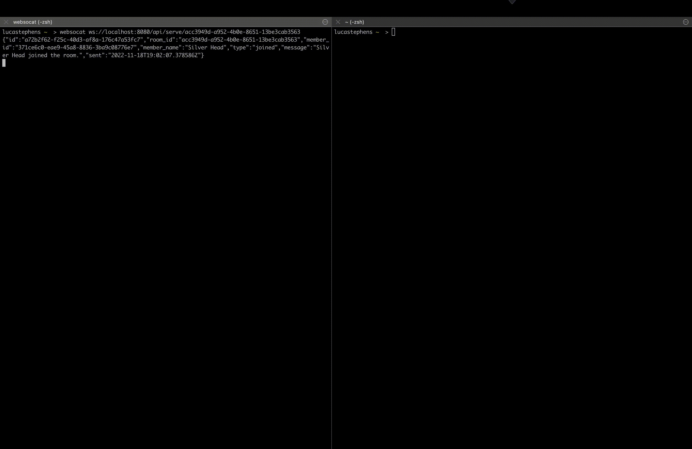
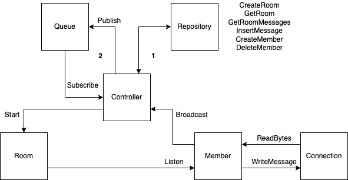

# sharechat.dev

A simple, horizontally scalable chat server that mimics IRC chat rooms:

- all users are anonymous and assigned a random user name
- users do not persist after a connection; if you close the room and re-open it in your browser, you will be registered as a new user
- messages are only persisted for as long as the room exists

## Getting Started

To test the websocket endpoints, I recommend using [websocat](https://github.com/vi/websocat). You can install it via:

    brew install websocat

If you want to see try a live version of this server, open a few terminals or grab a few devices (or friends!) and run the following:

    websocat wss://sharechat.up.railway.app/api/serve/b755ba0e-c18a-4177-ab99-5893b411b5c1

You can run the full application end-to-end using docker-compose. First spin up Redis (used as a queue) and Postgres (used as the storage):

    docker-compose up -d redis postgres

Once Redis & Postgres are healthy, start the server:
    
    docker-compose up sharechat

### Creating a Room

Rooms are created by sending a POST request to `/api/room`:

    curl -i -X POST localhost:8080/api/room

    HTTP/1.1 200 OK
    Content-Type: application/json
    Date: Fri, 18 Nov 2022 18:15:11 GMT
    Content-Length: 80

    {
        "roomId":"acc3949d-a952-4b0e-8651-13be3cab3563","roomName":"Imperfect Seat"
    }

### Connecting to a room

To connect to a room, connect to the websocket endpoint served at `/api/serve/<room-id>`:

    websocat ws://localhost:8080/api/serve/<room-id>

Once you're connected, you can simply type a message and hit enter to send a message to the room!

### Running Tests

This application includes unit tests for race conditions, integration tests for all interface implementations, and full end-to-end tests for the entire request flow. 

Unit tests & integration tests are written alongside the application code and tagged with `unit` and `int` respectively. End-to-end tests are separated into the `test/e2e` folder, where we leverage [httpexpect](https://github.com/gavv/httpexpect) heavily. 

To run unit tests:

    make unit-test

To run integration or end-to-end tests, you must have the docker-compose services running:

    make int-test
    make e2e-test

To view code-coverage, you must have [go tools](https://pkg.go.dev/golang.org/x/tools) installed:

    make view-coverage

## Architecture

This application follows a [hexagonal architecture](https://netflixtechblog.com/ready-for-changes-with-hexagonal-architecture-b315ec967749). The main benefit from this architecture is the decoupling of application/business logic from implementation details such as data storage and data transport. 

The current version of the application implements HTTP with websockets as the transport layer, PostgreSQL as the storage layer, and Redis as the message queue. Each of these interfaces can be swapped out for a different implementation.

Below is the dataflow diagram of our application:

Concepts:

- Repository: the source-of-truth for data storage for Rooms, Members, and Messages. Supports the following methods:
    - `CreateRoom`
    - `GetRoom`
    - `GetRoomMessages`
    - `InsertMessage`
    - `CreateMember`
    - `DeleteMember`

- Queue: a Pub/Sub message bus responsible for forwarding messages to different rooms. In this model, a Room is simply a topic, and Controller instances are both publishers and subscribers.
    - `Publish`: publish a message to a Room
    - `Subscribe`: returns a function that can be called to listen on a stream of messages coming from a Room.
    - Note: the Controller guarantees that messages are always written to the Repository before being published to the Queue. If a message is successfully written to the Repository but not published to the queue, the Controller will delete the message & clients will have to re-fetch messages from the API. The next iteration of the project may examine 2PC, Saga patterns, or even an event-sourced architecture to solve this problem.

- Controller: the main application; the Controller is responsible for managing the lifecycle of Rooms and Members. It creates Rooms, assigns Members to Rooms, writes data to the Repository & publishes/subscribes to the Queue. Each instance of a Controller can serve any Room; you may have a single Room being served by multiple controllers, which means that not every Member of a Room needs to be serviced by the same Controller instance. Because data is centralized via the Repository & Queue, this makes our chat server horizontally scalable.

- Connection: represents a connection from the user's device. `ReadBytes` forwards messages from the device to a Room. `WriteMessage` forwards messages from a Room to a device. Currently implemented as a websocket connection. 

- Member: represents a user within a given Room. Each Member is associated with a single Connection and spawns two goroutines; one to forward messages from the Connection to the Controller, and another to forward messages from the Room to the Connection.
    - `Broadcast`: called by the Controller to begin streaming messages from the Member to the Room.
    - `Listen`: called by the Controller to begin streaming messages from the Room to the Member.

- Room: represents the overall chat channel; each Room can have 0-N Members. Messages posted to a Room are forwarded to all Members of that Room. Each Room maintains a list of Members & spawns a single goroutine to receive messages from the Controller and forward them to each Member. 
    - `Start`: called by the Controller to start the Room.

## API

### `/api/healthz`

Method: GET

Description: Returns whether the application is healthy; defined by being able to connect to the Repository & Queue implementations.

Request: Empty body

Response: HTTP 200 status code if healthy, HTTP 503 status code if unhealthy

### `/api/room`

Method: POST

Description: Creates a new Room.

Request: Empty body

Response: 

    {
        "roomId":"<room-id>",
        "roomName":"<room-name>"
    }

### `/api/room/<room-id>`

Method: GET

Description: Returns the current state of the Room, including the current Members in the room.

Request: Empty body

Response: 

    {
        "roomId":"<room-id>",
        "roomName":"<room-name>"
        "members": [
            {
                "id":"<member-id>",
                "name":"<member-name>"
            }
        ]
    }

### `/api/room/<room-id>/messages`

Method: GET

Description: Returns all historical messages for a Room.

Request: Empty body

Response:

    [
        {
            "id": "<message-id>",
            "roomId": "<room-id>",
            "memberId": "<member-id>",
            "memberName": "<member-name>",
            "type": "<'chat' | 'joined' | 'left' | 'failed'>",
            "message": "<message>",
            "sent": "<timestamp>"
        }
    ] 
### `/api/serve/<room-id>`

Method: GET

Description: HTTP endpoint that upgrades the connection to a websocket, and forwards & receives messages for the given room.

Request Headers:

    Connection: Upgrade
    Upgrade: websocket
